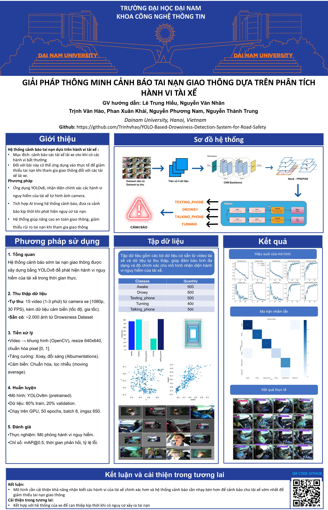

<div align="center">
<h1># 🎓 Hệ Thống Phát Hiện Tai Nạn Giao Thông</h1>
</div>
<div align="center">
  
  
</div>

<div align="center">

[](https://fit.dainam.edu.vn)  
[](https://fit.dainam.edu.vn)  
[](https://dainam.edu.vn)

</div>

<h3 align="center">🔬 Tăng Cường An Toàn Giao Thông Thông Qua Sáng Tạo AI và IoT</h3>

<p align="center">
  <strong>Hệ Thống Thông Minh Phát Hiện và Cảnh Báo Sớm Tai Nạn Giao Thông Dựa trên Hành Vi Tài Xế Sử Dụng YOLO</strong>
</p>

<p align="center">
  <a href="#-kiến-trúc">Kiến trúc</a> •
  <a href="#-tính-năng-chính">Tính năng</a> •
  <a href="#-công-nghệ-sử-dụng">Công nghệ</a> •
  <a href="#-cài-đặt">Cài đặt</a> •
  <a href="#-bắt-đầu">Bắt đầu</a> •
  <a href="#-tài-liệu">Tài liệu</a>
</p>

---

## 🏗️ Kiến trúc

<div align="center">
  
</div>

Hệ thống sử dụng kiến trúc ba tầng:

1. **📹 Tầng Thu Thập Dữ Liệu**: Ghi lại video thời gian thực từ camera và thu thập dữ liệu từ cảm biến IoT (ví dụ: tốc độ, khoảng cách) để giám sát hành vi tài xế.
2. **💾 Tầng Lưu Trữ**: Lưu trữ các khung hình video và dữ liệu đã xử lý trong thư mục `data` (dữ liệu thu thập) và `data2` (dữ liệu tự chụp) để huấn luyện và suy luận.
3. **🤖 Tầng Xử Lý AI**: Sử dụng YOLO để phát hiện đối tượng (ví dụ: phương tiện, người đi bộ) và phân tích hành vi (ví dụ: rời làn đường, buồn ngủ) nhằm phát hiện tai nạn tiềm ẩn và kích hoạt cảnh báo.

---

## ✨ Tính năng chính

### 🧠 Tích hợp AI và IoT Nâng Cao
- **Phát Hiện Đối Tượng với YOLO**: Phát hiện phương tiện, người đi bộ và các chướng ngại vật trên đường bằng mô hình YOLO được huấn luyện trên dữ liệu tùy chỉnh.
- **Phân Tích Hành Vi Tài Xế**: Theo dõi hành vi của tài xế (ví dụ: buồn ngủ, mất tập trung) bằng khung hình video và dữ liệu cảm biến IoT.
- **Hệ Thống Cảnh Báo Thời Gian Thực**: Gửi cảnh báo qua thiết bị IoT (ví dụ: còi, thông báo Telegram) khi phát hiện nguy cơ tai nạn.

### ⚡ Xử Lý Hiệu Suất Cao
- **Gán Nhãn Dữ Liệu Hiệu Quả**: Sử dụng LabelImg để gắn nhãn cho hình ảnh trong thư mục `data` và `data2`.
- **Huấn Luyện trên Dữ Liệu Tùy Chỉnh**: Huấn luyện mô hình YOLO trên dữ liệu kết hợp từ `data` (dữ liệu thu thập) và `data2` (dữ liệu tự chụp).
- **Suy Luận Thời Gian Thực**: Xử lý luồng video với độ trễ thấp để đưa ra cảnh báo kịp thời.

### 📊 Giám Sát Toàn Diện
- **Phản Hồi Trực Quan**: Hiển thị các đối tượng được phát hiện và hành vi tài xế theo thời gian thực.
- **Nhật Ký Chi Tiết**: Ghi lại các sự kiện có nguy cơ tai nạn với thời gian và điểm tin cậy.
- **Tích hợp IoT**: Kết hợp dữ liệu camera với dữ liệu cảm biến để giám sát toàn diện.

---

## 🔧 Công nghệ sử dụng

<div align="center">

### Công nghệ cốt lõi
[](https://www.python.org/)  
[](https://pjreddie.com/darknet/yolo/)  
[](https://opencv.org/)  
[](https://github.com/tzutalin/labelImg)  

### IoT và Phần cứng
[](https://www.raspberrypi.org/)  
[](https://www.arduino.cc/)  
[](https://core.telegram.org/api)

</div>

---

## 📥 Cài đặt

### 🛠️ Yêu cầu trước khi cài đặt

- 🐍 **Python** `3.12` - Ngôn ngữ lập trình chính cho xử lý AI.
- 📷 **Mô-đun Camera** - Để ghi lại video thời gian thực (ví dụ: webcam USB hoặc camera Raspberry Pi).
- 🌐 **Phần cứng IoT** - Raspberry Pi hoặc Arduino để tích hợp cảm biến và cảnh báo.
- 🖴 **Dung lượng lưu trữ** `5GB+` - Để lưu trữ dữ liệu trong thư mục `data` và `data2`.
- 💻 **CPU/GPU** - GPU được khuyến nghị để huấn luyện YOLO nhanh hơn.
- 📦 **Git** - Để tải mã nguồn từ kho lưu trữ.

### ⚙️ Thiết lập dự án

1. **Tải mã nguồn**:
   ```bash
   git clone https://github.com/Trinhvhao/YOLO-Based-Drowsiness-Detection-System-for-Road-Safety.git
   cd drowsiness_detection
   ```

2. **Tạo môi trường ảo**:
   ```bash
   python -m venv venv
   source venv/bin/activate  # Windows: venv\Scripts\activate
   ```

3. **Cài đặt các thư viện cần thiết**:
   ```bash
   pip install -r requirements.txt
   ```

4. **Cấu hình môi trường**:
   - Sao chép file mẫu cấu hình môi trường:
     ```bash
     cp .env.example .env
     ```
   - Chỉnh sửa file `.env` với các cài đặt của bạn (ví dụ: Telegram Bot Token, Chat ID).

5. **Chuẩn bị dữ liệu**:
   - Đặt dữ liệu thu thập vào thư mục `data`.
   - Đặt hình ảnh/video tự chụp vào thư mục `data2`.
   - Sử dụng LabelImg để gắn nhãn cho hình ảnh trong cả hai thư mục `data` và `data2`.

6. **Huấn luyện mô hình YOLO**:
   ```bash
   python train_yolo.py --data dataset.yaml --weights yolov8s.pt --epochs 50
   ```

---

## 🚀 Bắt đầu

### ⚡ Khởi động nhanh
Chạy script chính để xử lý luồng video, phát hiện đối tượng, phân tích hành vi tài xế, và gửi cảnh báo:
```bash
python main.py --model yolo_weights/best.pt --source 0  # Sử dụng webcam làm nguồn đầu vào
```

### 📥 Thêm dữ liệu mới
1. Thu thập dữ liệu mới và lưu vào thư mục `data2`.
2. Gắn nhãn dữ liệu mới bằng LabelImg:
   ```bash
   labelimg data2
   ```
3. Huấn luyện lại mô hình YOLO:
   ```bash
   python train_yolo.py --data data.yaml --weights yolo_weights/best.pt --epochs 20
   ```

---

## 📜 Poster Dự Án

<div align="center">
  
</div>

## 📚 Tài liệu
Để xem tài liệu chi tiết, vui lòng truy cập [Wiki](https://github.com/drkhanusa/DNU_TrafficAccidentDetection/wiki) hoặc tham khảo các phần sau:
- 📖 [Hướng Dẫn Cài Đặt](#-cài-đặt)
- 👥 [Hướng Dẫn Sử Dụng](#-bắt-đầu)
- 🔧 [Tài Liệu API](#)
- 🤝 [Hướng Dẫn Đóng Góp](#)

---

## 📝 Giấy phép
© 2024 AIoTLab, Khoa Công Nghệ Thông Tin, Đại Học Đại Nam. Mọi quyền được bảo lưu.

<div align="center">
  Được thực hiện với 💻 bởi AIoTLab tại Đại Học Đại Nam  
  [Website](https://fit.dainam.edu.vn) • [GitHub](https://github.com/drkhanusa) • [Liên Hệ](#)
</div>
```
